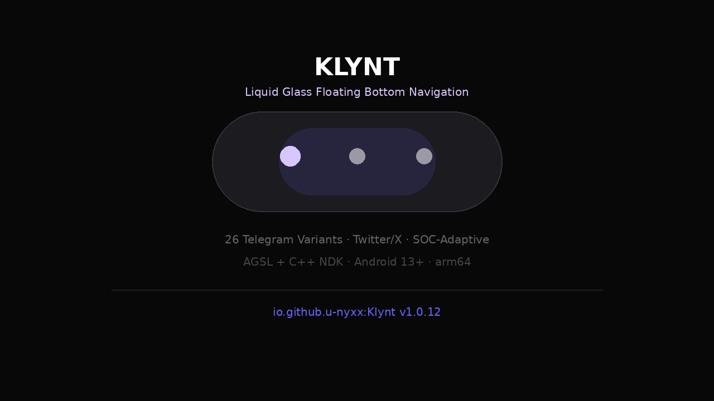

# Velra

Glass engine for Android. `AGSL + RenderEffect + C++`. Powers [Klynt](https://github.com/U-Nyxx/Klynt).

<p>
  <a href="https://github.com/U-Nyxx/velra/releases"></a>
  <a href="https://jitpack.io/#U-Nyxx/velra"></a>
  <a href="LICENSE"></a>
  
  
</p>



No bitmap capture. `libvelra.so` via NDK. Loop-free AGSL for Mali.

### Install

```kotlin
// Maven Central
implementation("io.github.u-nyxx:velra:0.1.1")

// JitPack
maven("https://jitpack.io")
implementation("com.github.U-Nyxx:velra:0.1.1")
```

### Use

```kotlin
val view = VelraGlassView(context).apply {
    configure(SocDetector.resolve(context), intensity = 1f, blurEnabled = true)
    setBarRect(0, 0, width, height)
    post { animateIntensityTo(1f) } // spring 170/0.72
}
```

`configure` picks `blur 18/12/8` + `dispersion` + `bevel` per SOC. `animateIntensityTo` springs `0→1`.

### Configure · Language

Velra is **not full Kotlin** — 3 languages:

| Layer | Language | File |
|-------|----------|------|
| Orchestration | Kotlin 2.0.21 | `VelraGlassView.kt` `SocDetector.kt` |
| GPU | AGSL | `VelraGlassShader.kt:29` `VELRA_GLASS_SHADER` `uniform shader backdrop` |
| Hardware | C++ 17 | `src/main/cpp/velra.cpp` `__system_property_get` + `sysconf` |

Gradle:

```kotlin
android {
    ndkVersion = "27.0.12077973"
    externalNativeBuild.cmake { path = file("src/main/cpp/CMakeLists.txt") }
}
```

Kotlin calls C++ via JNI:

```kotlin
object VelraBridge { external fun stringFromJNI(): String } // libvelra.so
object SocDetector { external fun nativeHardware(): String } // ro.hardware direct
class VelraGlassView { external fun nativeIsLowRam(): Boolean } // sysconf
```

`.gitattributes` maps `*.cpp → C++`, `*.agsl → GLSL` so GitHub shows `Kotlin • C++ • GLSL` — not just Kotlin.

### Tiers

- `SHADER` 4 taps (3 CA + center) blur 18 — 8 Elite / Tensor
- `LITE` 2 taps blur 12 — SD 6/7 Dimensity 8k/9k Exynos
- `SCRIM` Canvas `0xD61E2A3A` blur 8 — 700 / low-RAM / thermal

`selectGlassTier(frosted, lowRam, thermal, highQuality)` is pure JVM.

### Build

```bash
./gradlew :velra:assembleRelease   # 22K aar
./gradlew :velra:publishToMavenLocal  # ~/.m2/io/github/u-nyxx/velra/0.1.1/
```

`minSdk 33` (RuntimeShader), `compileSdk 34`, `JDK 17`, `NDK 27`, `CMake 3.22`

### License

MIT — U-Nyxx
